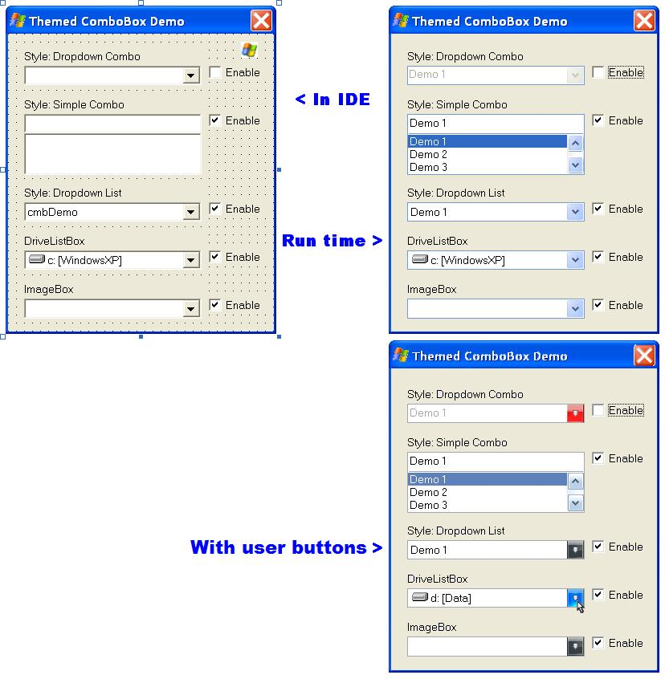



## ThemedComboBox

### Description

Some little chamges are made in de sourcecode

Fixed some bugs

Add properties so the user can customize the ComboBox button.

Update, some bugs fixed.

This control subclassed all comboboxes on the parent form and chaged the skin of all in the windows themed skin.
 
### More Info
 

             |
---                |---
**Submitted On**   |2011-11-30 02:00:00
**By**             |[Ben Vonk](https://github.com/Planet-Source-Code/PSCIndex/blob/master/ByAuthor/ben-vonk.md)
**Level**          |Intermediate
**User Rating**    |4.9 (34 globes from 7 users)
**Compatibility**  |VB 6\.0
**Category**       |[Custom Controls/ Forms/  Menus](https://github.com/Planet-Source-Code/PSCIndex/blob/master/ByCategory/custom-controls-forms-menus__1-4.md)
**World**          |[Visual Basic](https://github.com/Planet-Source-Code/PSCIndex/blob/master/ByWorld/visual-basic.md)
**Archive File**   |[ThemedComb2220712262012\.zip](https://github.com/Planet-Source-Code/ben-vonk-themedcombobox__1-71236/archive/master.zip)

